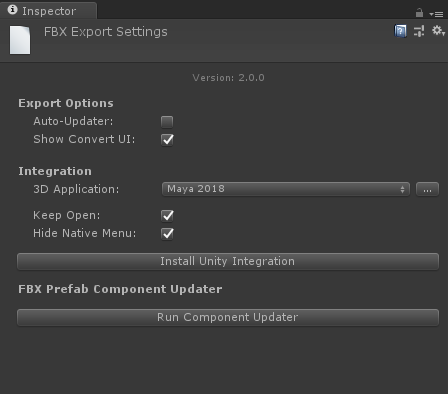

# Setting FBX Export options

Use the Fbx Export Settings window to specify whether or not to automatically update [Linked Prefabs](prefabs.html) and to install the [Unity Integration](integration.html) for Autodesk® Maya®, Autodesk® Maya LT™, or Autodesk® 3ds Max®.

## Fbx Export Settings window

| Property:                     | Function:                                                    |
| :---------------------------- | :----------------------------------------------------------- |
| __Auto-Updater__              | Check this option to enable automatic updating for Linked Prefabs whenever their linked FBX file is updated. |
| __3D Application__            | Select the 3D modeling software you want to integrate with Unity. Autodesk® Maya® 2017+, Autodesk® Maya LT™ 2017+, and Autodesk® 3ds Max® 2017+ are the three applications currently supported.  Click the Browse button to choose a 3D modeling software installed in a non-standard location. |
| __Keep Open__                 | Check this option to keep the selected 3D modeling software open after installing it. |
| __Hide Native Menu__          | Check this option to hide the native __Send to Unity__ menu in Autodesk® Maya® and Autodesk® Maya LT™. |
| __Install Unity Integration__ | Click this button to install [Unity Integration](integration.html) for the selected __3D Application__. |
| __Run Component Updater__     | Click this button to run the [Component Updater](#Repairs_1_1_0b_1) to repair any broken FbxPrefab components if you were using a previous version of the FBX Exporter package. |

